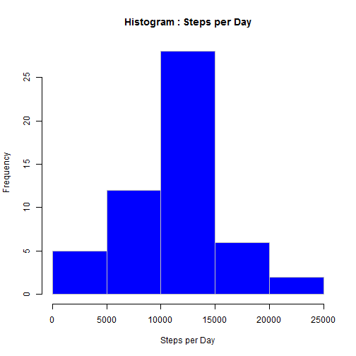
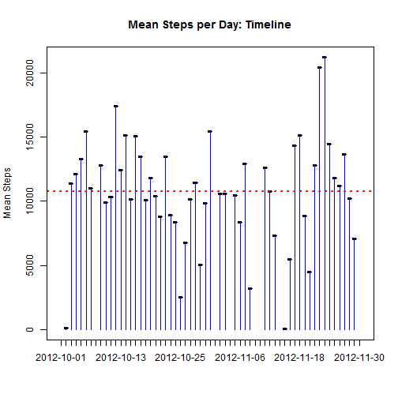
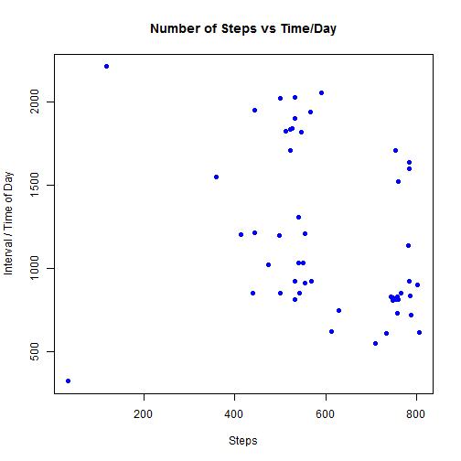
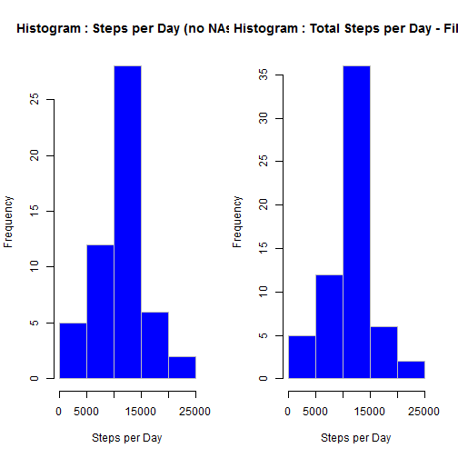
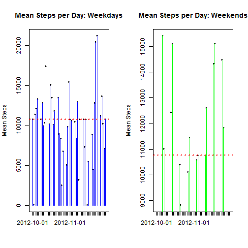
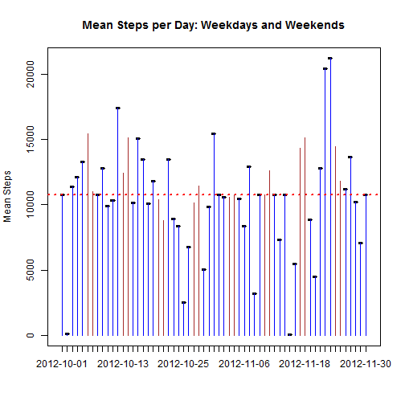

This document details all the tasks taken in order to analyze a data set made of the number of steps taken of an anonymous invididual in the period October-November 2012.  The steps were counted using a 5-minutes interval through a personal activity monitoring device.

### Source Data

The first task was importing the "activity.csv" file which contains the source data described aboce into the *dataset* data frame.  The data.csv function was used.


```r
## Sets working directory
setwd("C:/Users/gustavo/Dropbox/_Coursera/ReproducibleResearch/P1")

## Reads data into data frame 
dataset = data.frame(read.csv("activity.csv", header = TRUE))
head(dataset)
```

```
##   steps       date interval
## 1    NA 2012-10-01        0
## 2    NA 2012-10-01        5
## 3    NA 2012-10-01       10
## 4    NA 2012-10-01       15
## 5    NA 2012-10-01       20
## 6    NA 2012-10-01       25
```


### 1. What is mean total number of steps taken per day?

The first calculation assigned was to explore the information and calculate, per day, the total number of steps given.  For that to happen, a new dataset was generated, which eliminates the NAs from the steps column.  This dataset will be used as the data source of the report.


```r
# Ignore missing values 
meandata <- subset(dataset, steps != "NA")
```

#### 1. Make a histogram of the total number of steps taken each day


```r
# Aggregates the number of steps per day
stepsdayTotal <- aggregate(meandata[,1], list(Date1 = meandata$date), sum)
# Generates the graphic
plot.new()
par(mfrow=c(1, 1)) 
hist(stepsdayTotal[,2], main ="Histogram : Steps per Day", xlab="Steps per Day", col="blue", border="gray")
```

 

I attach the summary of the variable for the reader to have a better understanding of its scope.


```r
# Summary of the variable
summary(stepsdayTotal[,2])
```

```
##    Min. 1st Qu.  Median    Mean 3rd Qu.    Max. 
##      41    8841   10760   10770   13290   21190
```

#### 2. Calculate and report the mean and median total number of steps taken per day

An explanation should be added here before continuing: The mean and median, aggregated by date, will be very low as the intervals consider times when the subject was sleeping.  The approach here is to calculate the mean and median per day, which will generate a number, and multiply it times 288, the number of daily intervals of the measure, in order to get an approximate of steps per day.


```r
# Calculation of the mean
stepsdayMean <- aggregate(meandata[,1], list(Date1 = meandata$date), mean)
# Configures the column headers
colnames(stepsdayMean) <- c("Date", "MeanSteps")
# Scales the results
stepsdayMean$PerDay <- stepsdayMean$MeanSteps * 288
# Obtains the complete listing per day
head(stepsdayMean)
```

```
##         Date MeanSteps PerDay
## 1 2012-10-02   0.43750    126
## 2 2012-10-03  39.41667  11352
## 3 2012-10-04  42.06944  12116
## 4 2012-10-05  46.15972  13294
## 5 2012-10-06  53.54167  15420
## 6 2012-10-07  38.24653  11015
```

The Calculation of the median applies the same approach, but as the Median of every day = 0, then the number of steps = 0


```r
stepsdayMedian <- aggregate(meandata[,1], list(Date1 = meandata$date), median)
colnames(stepsdayMedian) <- c("Date", "MedianSteps")
head(stepsdayMedian,5)
```

```
##         Date MedianSteps
## 1 2012-10-02           0
## 2 2012-10-03           0
## 3 2012-10-04           0
## 4 2012-10-05           0
## 5 2012-10-06           0
```

### 2.What is the average daily activity pattern?

#### 1. Make a time series plot (i.e. type = "l" ) of the 5-minute interval (x-axis) and the average number of steps taken, averaged across all days (y-axis)

For this report to be built, the TotalSteps column of the *stepsdayTotal* data source will be graphed.  As a reference line, the general mean of the Total Steps column is also added with an *abline* command.


```r
# Calculates the General Average of steps per day to have it as a reference line
gralavg = mean(stepsdayMean$PerDay)

# Generates a new graphic with the information required
plot.new()
plot(stepsdayMean$Date, stepsdayMean$PerDay, type="h", lty="solid" , lwd=1,
     main="Mean Steps per Day: Timeline", ylab="Mean Steps",
     col="red")
lines(stepsdayMean$Date, stepsdayMean$PerDay, type="h", lty="solid" , lwd=1, col="blue")
# Generates the reference line
abline(h=gralavg, col="red", lwd="2", lty="dotted")
```

 


#### 2. Which 5-minute interval, on average across all the days in the dataset, contains the maximum number of steps?


```r
# Generates the aggregation for the max number of steps
maxsteps <- data.frame(aggregate(meandata[,1], list(Date = meandata$date), max))
colnames(maxsteps)= c("Date","MaxSteps")

# Searches for the max number of steps in the main data set and assigns the interval to it
for (i in 1:nrow(maxsteps))
{
 tmp <- subset(meandata, meandata$date==as.character(strptime(maxsteps[i,1], "%Y-%m-%d")) & steps == maxsteps[i,2])
 maxsteps$interval[i] <- tmp[1,3]
}
# Shows the first lines of the maxsteps dataset
head(maxsteps)
```

```
##         Date MaxSteps interval
## 1 2012-10-02      117     2210
## 2 2012-10-03      613      620
## 3 2012-10-04      547     1815
## 4 2012-10-05      555     1210
## 5 2012-10-06      526     1840
## 6 2012-10-07      523     1710
```

An alternative way of visualizing the maximum steps during the day is to plot a X,Y scatter combining the two variables.


```r
 plot.new()
 plot(maxsteps$MaxSteps, maxsteps$interval, main="Number of Steps vs Time/Day", ylab="Interval / Time of Day", xlab="Steps", pch=19, col="blue")
```

 


### 3. Missing Values


#### 1. Calculate and report the total number of missing values in the dataset 

A new temporary dataset is generated which contains only NAs.  Then the number of rows is directly calculated.


```r
dataNA <- subset(dataset, is.na(steps))
numNA <- nrow(dataNA)
numNA
```

```
## [1] 2304
```

#### 2. Filling the missing values

To fill the missing values, the defined criteria was to use the general mean of the dataset (gralavg) already calculated.  This figure will be assigned to all rows where steps = NA

#### 3. Create a new dataset that is equal to the original dataset but with the missing data filled in.

The dataset will link the *meandata* data set already used into the first calculations with the newly created *dataNA* dataset, which contains all rows with NA.


```r
# Assigns the general average, divided by the number of intervals
for (i in 1:numNA)
{
  dataNA[i,1] <- gralavg / 288
}
# Builds a new dataset with the correction
datasetFilled <- rbind(meandata, dataNA)
# Check for total # of rows
nrow(datasetFilled)
```

```
## [1] 17568
```

#### 4. Make a histogram of the total number of steps taken each day and Calculate and report the mean and
median total number of steps taken per day.  


```r
# Geneates a new data set stespdayTotal2, to generate the new histogram
stepsdayTotal2 <- aggregate(datasetFilled[,1], list(Date1 = datasetFilled$date), sum)
## histogram of the total number of steps taken each day
hist(stepsdayTotal2[,2], main ="Histogram : Total Steps per Day - Filled", 
     xlab="Steps per Day", col="blue", border="gray")
```

 

```r
# Generates a summary of the variable
summary(stepsdayTotal2[,2])
```

```
##    Min. 1st Qu.  Median    Mean 3rd Qu.    Max. 
##      41    9819   10770   10770   12810   21190
```

Graphic can be combined and compared with the first one


```r
plot.new()
par(mfrow=c(1, 2)) 
hist(stepsdayTotal[,2], main ="Histogram : Steps per Day (no NAs)", xlab="Steps per Day", col="blue", border="gray")
hist(stepsdayTotal2[,2], main ="Histogram : Total Steps per Day - Filled", 
     xlab="Steps per Day", col="blue", border="gray")
```

 

Calculates the new mean and new median


```r
# Calculation of the mean and median with the new Filled data set
stepsdayMean2 <- aggregate(datasetFilled[,1], list(Date1 = datasetFilled$date), mean)
stepsdayMedian2 <- aggregate(datasetFilled[,1], list(Date1 = datasetFilled$date), median)
colnames(stepsdayMean2) <- c("Date", "MeanSteps")
colnames(stepsdayMedian2) <- c("Date", "MedianSteps")
```

*What is the impact of imputing missing data on the estimates of the total daily number of steps?*

The impact is that for empty lines where NA was assigned, now the user will have a proxy for that information.
In the case of the median, now it is the interval average, so information will be there as well.

### 4.Are there differences in activity patterns between weekdays and weekends?
The Filled data set will be used as the base data
The first step is to generate a new colun in the Filled data set called wkday, which will contain a factor variable "weekend" or "weekday", depending on the day.


```r
# Adds the wkday column
for (i in 1:nrow(datasetFilled))
{
   tmpwkday <- weekdays(strptime(datasetFilled$date[i], "%Y-%m-%d"), abbreviate=TRUE)  
   if (tmpwkday == "Sat" || tmpwkday=="Sun")
     datasetFilled$wkday[i] = "weekend"
   else
     datasetFilled$wkday[i] = "weekday"
}
```

Then a new aggregated data set is generated by date, and by weekend or weekday


```r
# Weekend data 
wkend <- subset(datasetFilled, wkday == "weekend")
wkd <- subset(datasetFilled, wkday == "weekday")

wkendMean <- aggregate(wkend[,1], list(Date1 = wkend$date), sum)
wkdMean <- aggregate(wkd[,1], list(Date1 = wkd$date), sum)
```

Finally, a new set of plots is generated in a panel, so the user can analyze the different behavior of them.
In brief, you will see that during weekends, people walk more or less the same than in weekdays


```r
# Comparison plot between weekday and weekend
plot.new()
par(mfrow=c(1, 2)) 
# Weekdays graphic
plot(wkdMean$Date1, wkdMean$x, type="h", lty="solid" , lwd=1,
     main="Mean Steps per Day: Weekdays", ylab="Mean Steps",
     col="red")
lines(wkdMean$Date1, wkdMean$x, type="h", lty="solid" , lwd=1, col="blue")
abline(h=gralavg, col="red", lwd="2", lty="dotted")

# Weekend
plot(wkendMean$Date1, wkendMean$x, type="h", lty="solid" , lwd=1,
     main="Mean Steps per Day: Weekends", ylab="Mean Steps",
     col="red")
lines(wkendMean$Date1, wkendMean$x, type="h", lty="solid" , lwd=1, col="green")
abline(h=gralavg, col="red", lwd="2", lty="dotted")
```

 

A combined graphic is also a good option to compare the behavior...


```r
plot.new()
par(mfrow=c(1, 1)) 
# Generates the weekday bars
plot(wkdMean$Date1, wkdMean$x, type="h", lty="solid" , lwd=1,
     main="Mean Steps per Day: Weekdays and Weekends", ylab="Mean Steps",
     col="red")
lines(wkdMean$Date1, wkdMean$x, type="h", lty="solid" , lwd=1, col="blue")
abline(h=gralavg, col="red", lwd="2", lty="dotted")
# Generates the Weekend bars (red)
lines(wkendMean$Date1, wkendMean$x, type="h", lty="solid" , lwd=1,
     main="Mean Steps per Day: Weekends", ylab="Mean Steps",
     col="red")
lines(wkendMean$Date1, wkendMean$x, type="h", lty="solid" , lwd=1, col="brown")
```

 

